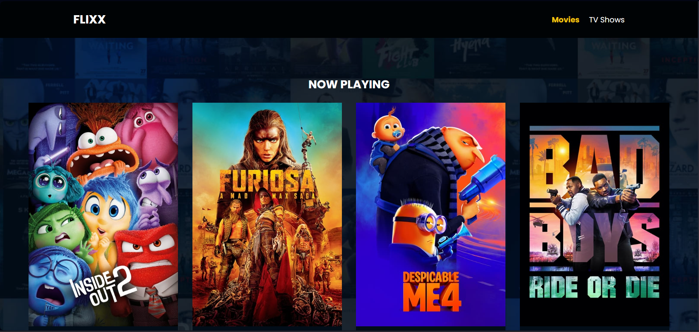

# Flixx App
Movie info application built with JavaScript that uses the TMDB API

This includes the most popular movies and TV shows with detail pages, a search box for movies and shows with full pagination and a slider for movies that are currently playing in theaters. The slider uses the [Swiper](https://swiperjs.com) library.
